# MKMP Tool Action file 
 

# This tool is only for FW Version : S20615

1. Create folder & copy `mkmp_1.4.2_linux_x86_x64.tar.bz2` into the folder.
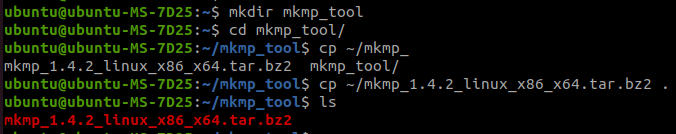 

1. Extract the `mkmp_1.4.2_linux_x86_x64.tar.bz2`    
 `Command: tar -zxvf mkmp_1.4.2_linux_x86_x64.tar.bz2`
 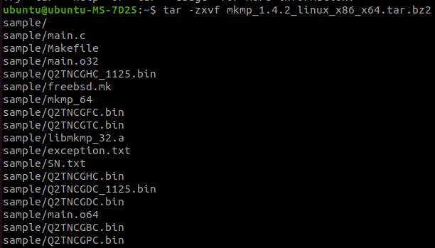 

1. Modify the SN.txt file ( Need to execute the Vendor command [ `mode 1` ] )  
   ## `Crossesponding Table`
    | Capacity(for `0721`) |      Bin file     |    Remark    |
    |       :---:          |       :----:      |     :---:    |
    |      `64GB`          |    Q2TNCGAC.bin   |              |
    |      `128GB`         |    Q2TNCGBC.bin   |              |
    |      `256GB`         |    Q2TNCGFC.bin   |    2CH 2CE   |
    |      `256GB`         |    Q2TNCGDC.bin   |    4CH 1CE   |
    |      `512GB`         |    Q2TNCGHC.bin   |              |
    |       `1T`           |    Q2TNCGPC.bin   |              |
    
    | Capacity(for `1125`) |     Bin file      |    Remark    |
    |       :---:          |      :----:       |     :---:    |
    |      `256GB`         | Q2TNCGDC_1125.bin |              |
    |      `512GB`         | Q2TNCGHC_1125.bin |              |

    ### **For example**  
    A. `YCA12105050030001` ( `0721` ) -> `512GB`  
    B. `A5341905300040001` ( `1125` ) -> `256GB`    

    |        `SN`          |       `mode`      |     `Bin file`    |
    |       :----:         |       :----:      |        :---:      |
    |   `YCA1210505003`    |         1         |    Q2TNCGHC.bin   |
    |   `A534190530004`    |         1         | Q2TNCGDC_1125.bin |  

    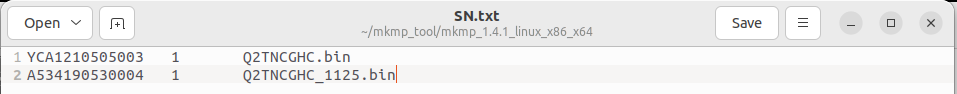   

2. Execute mkmp tool  
   1. Search device address
   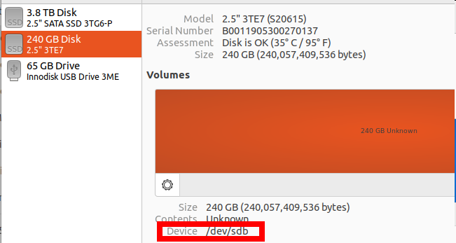
   
   2. Check device info
   `Command: sudo ./mkmp_64 -d /dev/sdb`
   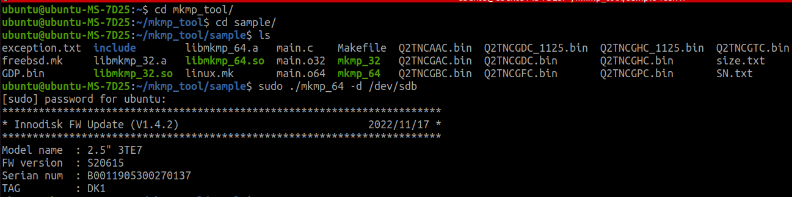

   3. Update FW  
   `Command: sudo ./mkmp_64 -d /dev/sda -f SN.txt -m 0`
   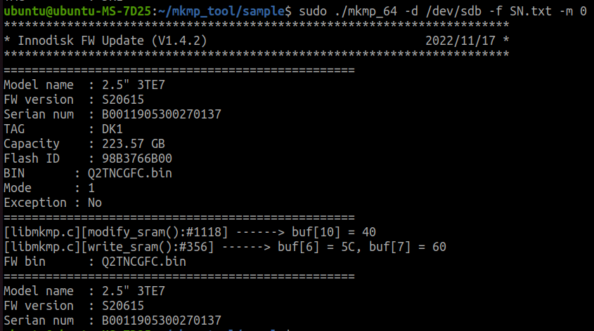  

3. Choose Chip Enable
   If `SN` not in the `SN.txt`, it will use normal DLMC without vender command.
   Only the device capacity is `256`GB, you need to select `4CH 1C` or `2CH 2C` and input `1` or `2`.  
   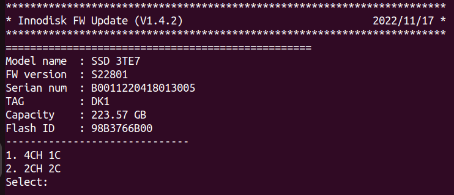
   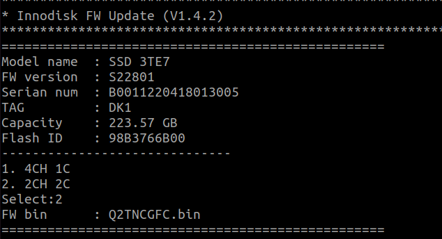  

   To distinguish whether it is `4CH 1C` or `2CH 2C`, you can watch the `P\N` next to last digits (custom code is not seen).  

   **Note**: **If the wrong selection is made, it will not affect the existing FW. After rebooting, firmware will not change and user should execute another option again.**

   If it is `D`, choose `2CH 2C`.  
   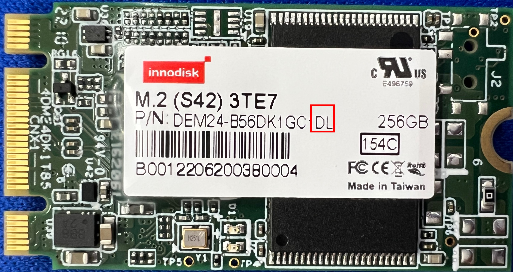  
   If it is `Q`, choose `4CH 1C`.  
   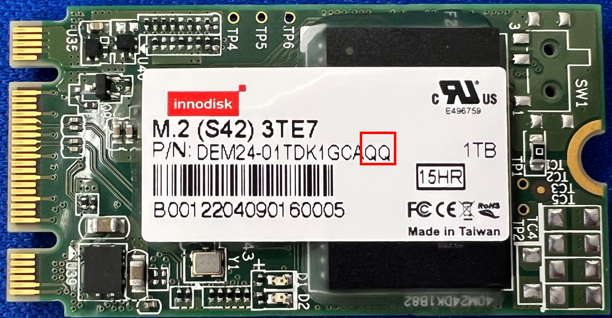

4. Reboot & check device info  
   `Command: sudo ./mkmp_64 -d /dev/sda`  
   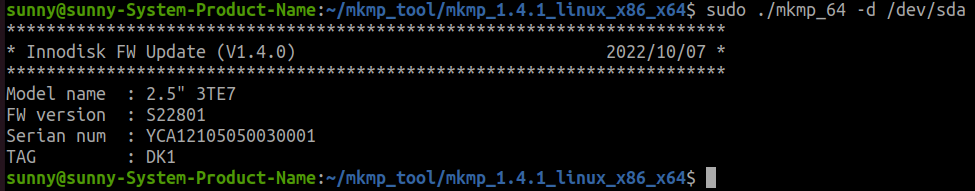  

