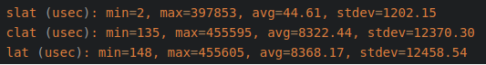
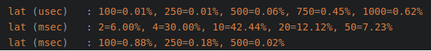

# FIO Command #

* `filename` : 指定要測試的磁碟.
* `direct` : 預設值為 `0` ,必須設定為 `1` 才會測試到真實的 `non-buffered I/O`.
* `ioengine` : 定義如何跑 `I/O` 的方式, `libaio` 是 `Linux` 本身非同步(asynchronous) `I/O` 的方式.其他還有 `sync` , `psync` , `vsync` , `posixaio` , `mmap` , `splice` , `syslet-rw` , `sg` , `null` , `net` , `netsplice` , `cpuio` , `guasi` , `external`.
* `time_based` : 測試以時間為單位,另外一種方式是以 `kb_base` (kilobyte).
* `runtime` : 這一測試所需的時間,單位為 秒.
* `iodepth` : 同一時間有多少 `I/O` 在做存取,越多不代表存儲裝置表現會更好,通常是 `RAID` 時須要設大一點.
* `refill_buffers` : `refill_buffers` 為預設值, 應該是跟 `I/O Buffer` 有關 ( `refill the IO buffers on every submit` ),把 `Buffer` 填滿就不會跑到 `Buffer` 的值.
* `group_reporting` : 如果 `numjobs` 有指定,設定 `group_reporting` 報告會以 `per-group` 的顯示方式,而不是預設的 `per-job` (會顯示所有個別 `numjobs` 的測試結果)
 * `wait_for_previous` : 預設所有的 `Job` 會一起執行, `wait_for_previous` 可以讓依序一個接著一個執行.

* `ramp_time` : 設定 `ramp_time` 會讓測試開始的一段時間不統計到整體效能裡,避免測試是跑在 `cache` 裏.
* `bs` : `bs` 或是 `blocksize` ,也就是檔案寫入大小,預設值為 `4K`, 如何設定這個值, 因為不同性質的儲存裝置需要不同的值. 看你是 `File Server`, `Web server`, `Database` … 設定都會不一樣.
* `rw` : 可以設定的參數如下, 通常在跑效能時會使用單純的 `read` 與 `write`, 其他可以使用參數如下:
  * `read` : Sequential reads. (循序讀)
  * `write` : Sequential writes. (循序寫)
  * `trim` : Sequential trim.
  * `randread` : Random reads. (隨機讀)
  * `randwrite` : Random writes. (隨機寫)
  * `randtrim` : Random trim.
  * `rw` : Mixed sequential reads and writes. (循序讀寫)
  * `readwrite` : Sequential read and write mix (循序混合讀寫)
  * `randrw` : Mixed random reads and writes. (隨機讀寫)
  * `trimwrite` : Trim and write mix, trims preceding writes.
* `cpumask`=`int` :
  * `FIO` 可以指定要使用哪一顆 `CPU` (邏輯處理器) 來運算,指定方式為 `Mask` (遮罩) 的方式.
  * `CPU 0` (0001) -> 1 ( `cpumask=1` ) <- 這是由第一顆核心來處理.
  * `CPU 1` (0010) -> 2 ( `cpumask=2` ) <- 這是由第二顆核心來處理.
  * `CPU 0+1` (0011) -> 3 ( `cpumask=3`) <- 代表要由一,二顆核心來處理.

* 測試會專注在 `Latency` 這一項目.
    * `lat` (`latency`) : 用以統計量測 `total latency numbers`.
    * `slat` (`submission latency`) : 用以統計量測 `completion latency numbers`.
    * `clat` (`completion latency`) : 用以統計量測 `submission latency numbers`.

* 想要得到越低的 `latency` (延遲值), `Fio` 建議設定 `ionice` 值或是透過參數 `prioclass` 與 `nice`.
  * `nice`=`int` : Run job with given nice value.
  * `prio`=`int` : Set I/O priority value of this job between 0 (highest) and 7 (lowest).
  * `prioclass`=`int` : Set I/O priority class.

* `IOPS` : 每秒的輸入輸出量(或讀寫次數)，是衡量硬碟性能的主要指標之一.
* `Bw` : 頻寬.

  
* `I/O` 延遲包含三種： `slat`，`clat`，`lat`
  * 關係是 `lat` = `slat` + `clat`；
* `slat` 表示 `fio submit` 某個 `I/O` 的延遲；
* `clat` 表示 `fio complete` 某個 `I/O` 的延遲；
* `lat` 表示從 `fio` 將請求提交给内核，再到内核完成這個 `I/O` 為止所需要的時間；

 
`usec` ： 微秒 
`msec` ： 毫秒
`1ms`=`1000`us；
這組數據表明 `lat`(`latency`：`延遲` )的分佈, 有 `0.01%` 的 `request` 延遲< `100us`，有 `0.01%` 是介於 `100us` < `request lat` < `250us`，有 `0.06%` 是介於 `250us` < `request lat` < `500us`.