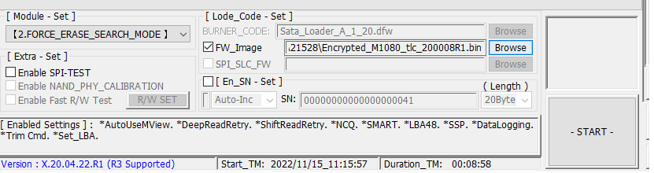
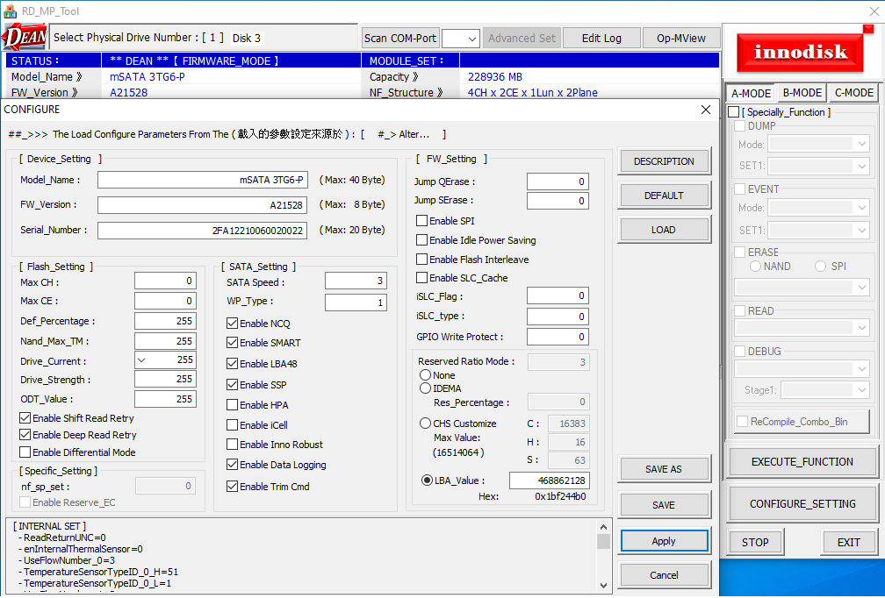
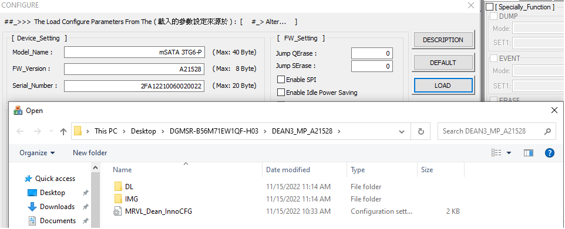

# 3TG6-P ReMP #
## Step by Step ##

### 必須透過 SATA 與主機板做串接才可開卡, 不能透過開卡板

1. 開啟應用程式, 點選 `FW Image` -> `Browse`, 選擇對應 `bin` file.

2. 點選 `CONFIGURE_SETTING`, 修改 `Serial Number`.

3. 點選 `FW Setting` -> `Load` -> `MRVL_Dean_InnoCFG`

4. 點選完成後, 回到上一頁點選 `SAVE` & `Apply`, 在回到第一步點選 `START` 進行更新.