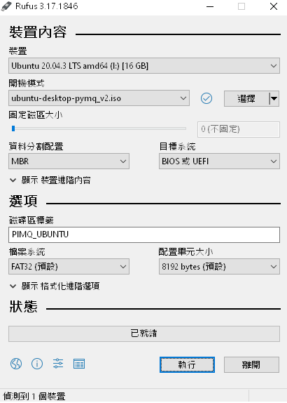
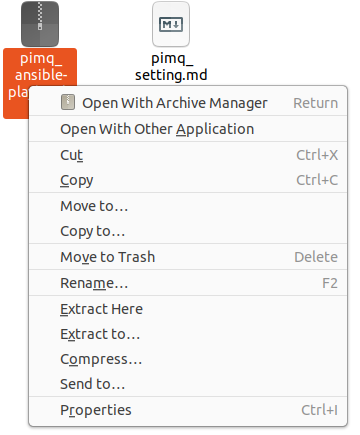
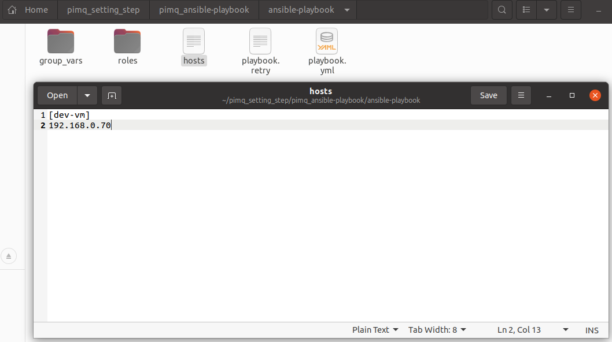
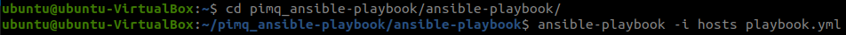

# 智影設備安裝設定步驟 #

1. 透過 `Googlw Driver` 將 image 下載( `https://drive.google.com/file/d/1_il8T6UKEqLE1Va8ZeZmX6og2Q9fKa9T/view?usp=sharing` ).
2. 準備 USB 一隻, 透過 `rufus` 製作開機碟.
   * `裝置` -> `USB`.  
   * `選擇` -> 點選 `ubuntu-desktop-pymq_v2.iso`.  
   * 完成後點選 `執行`.  
     
3. 需將電腦連上網.
4. 安裝完成, 設備重開機後, 開啟終端機( `Ctrl + T` )
5. 輸入以下指令.
   * `sudo apt update`.
   * `sudo apt install ansible ssh sshpass`.
6. 透過 `Googlw Driver` 將自動化安裝腳本下載( `https://drive.google.com/file/d/13cHs2SDwN1JDKci2LqNaZEpjrWdcLAQ5/view?usp=sharing` ).
7. 將自動化安裝腳本壓縮檔下載, 並解壓縮於家目錄, 滑鼠右鍵點選 `Extract Here`.
      
8. 修改需自動化安裝設備 `IP` ( `pimq_ansible-playbook` -> `ansible-playbook` -> `hosts` ), 依照設備配置 `IP` 做修改( 可多台 ), 如是機台本身安裝, 將 `192.168.0.70` 改為 `localhost`.
   
9. 開啟終端機, 輸入 `cd /home/pimq/pimq_ansible-playbook/ansible-playbook/`.
10. 輸入 `ansible-playbook -i hosts playbook.yml`, 執行自動化安裝, 重開機後完成所有安裝.
   